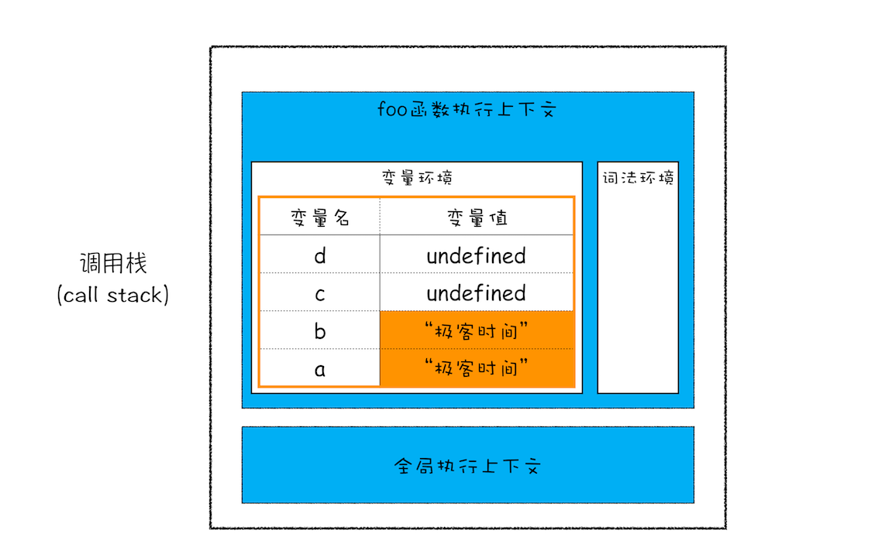

# 浏览器工作原理及实践

## 宏观视角下的浏览器

### HTTP请求流程：为什么很多站点第二次打开速度会很快？

浏览器使用 HTTP 协议作为应用层协议，用来封装请求的文本信息；并使用 TCP/IP 作传输层协议将它发到网络上，所以在 HTTP 工作开始之前，浏览器需要通过 TCP 与服务器建立连接。也就是说 HTTP 的内容是通过 TCP 的传输数据阶段来实现的，你可以结合下图更好地理解这二者的关系。

> 网络七层协议   
从下往上依次为物理层、数据链路层、网络层、传输层、会话层、表示层和应用层

### 渲染流程：HTML、CSS 和 JavaScript，是如何变成页面的？

按照渲染的时间顺序，流水线可分为如下几个子阶段：构建 DOM 树、样式计算、布局阶段、分层、绘制、分块、光栅化和合成。

#### 构建 DOM 树

为什么要构建 DOM 树呢？这是因为浏览器无法直接理解和使用 HTML，所以需要将 HTML 转换为浏览器能够理解的结构 —— DOM 树。


#### 样式计算

和 HTML 文件一样，浏览器也是无法直接理解这些纯文本的 CSS 样式，所以当渲染引擎接收到 CSS 文本时，会执行一个转换操作，将 CSS 文本转换为浏览器可以理解的结构 —— styleSheets。只需要在控制台中输入 document.styleSheets，然后就看到如下图所示的结构：


现在我们已经把现有的 CSS 文本转化为浏览器可以理解的结构了，那么接下来就要对其进行属性值的标准化操作。  
要理解什么是属性值标准化，你可以看下面这样一段 CSS 文本：  
```css
body { font-size: 2em }
p {color:blue;}
span  {display: none}
div {font-weight: bold}
div  p {color:green;}
div {color:red; }
```
可以看到上面的 CSS 文本中有很多属性值，如 2em、blue、bold，这些类型数值不容易被渲染引擎理解，所以需要将所有值转换为渲染引擎容易理解的、标准化的计算值，这个过程就是属性值标准化。  
那标准化后的属性值是什么样子的？


计算出 DOM 树中每个节点的具体样式，这里就涉及到 CSS 的继承规则和层叠规则了。CSS 继承就是每个 DOM 节点都包含有父节点的样式。样式计算过程中的第二个规则是样式层叠。层叠是 CSS 的一个基本特征，它是一个定义了如何合并来自多个源的属性值的算法。它在 CSS 处于核心地位，CSS 的全称“层叠样式表”正是强调了这一点。

#### 布局阶段

现在，我们有 DOM 树和 DOM 树中元素的样式，但这还不足以显示页面，因为我们还不知道 DOM 元素的几何位置信息。那么接下来就需要计算出 DOM 树中可见元素的几何位置，我们把这个计算过程叫做布局。
> 布局阶段主要完全两个任务：创建布局树和布局计算。  
DOM 树中还含有很多不可见的元素，比如 `head` 标签，还有使用了 `display: none` 属性的元素。所以在显示之前，我们还要额外地创建一棵只包含可见元素布局树。  
有了一棵完整的布局树。那么接下来，就要计算布局树节点的坐标位置了。在执行布局操作的时候，会把布局运算的结果重新写回布局树中，所以布局树既是输入内容也是输出内容，这是布局阶段一个不合理的地方，因为在布局阶段并没有清晰地将输入内容和输出内容区分开来。针对这个问题，Chrome 团队正在重构布局代码，下一代布局系统叫 LayoutNG，试图更清晰地分离输入和输出，从而让新设计的布局算法更加简单。

#### 分层

现在我们有了布局树，而且每个元素的具体位置信息都计算出来了，那么接下来是不是就要开始着手绘制页面了？答案依然是否定的。因为页面中有很多复杂的效果，如一些复杂的 3D 变换、页面滚动，或者使用 z-indexing 做 z 轴排序等，为了更加方便地实现这些效果，渲染引擎还需要为特定的节点生成专用的图层，并生成一棵对应的图层树（LayerTree）。

通常情况下，并不是布局树的每个节点都包含一个图层，如果一个节点没有对应的层，那么这个节点就从属于父节点的图层。
> 需要满足下列条件，渲染引擎才会为特定的节点创建新的层。
> - 第一点，拥有层叠上下文属性的元素会被提升为单独的一层。[层叠上下文参考文章](https://developer.mozilla.org/zh-CN/docs/Web/Guide/CSS/Understanding_z_index/The_stacking_context)
> - 第二点，需要剪裁（clip）的地方也会被创建为图层。（这里指的是比如有一段超过容器的文字，浏览器会出现滚动条，则浏览器会把文字内容单独创建一层，然后把这一层的部分显示在容器中，但是我在 Chrome79 上没有验证成功）

#### 图层绘制

渲染引擎会把一个图层的绘制拆分成很多小的绘制指令，然后再把这些指令按照顺序组成一个待绘制列表

#### 栅格化操作

绘制列表只是用来记录绘制顺序和绘制指令的列表，而实际上绘制操作是由渲染引擎中的合成线程来完成的。  
通常一个页面可能很大，但是用户只能看到其中的一部分，我们把用户可以看到的这个部分叫做视口（viewport）。  
在有些情况下，有的图层可以很大，比如有的页面你使用滚动条要滚动好久才能滚动到底部，但是通过视口，用户只能看到页面的很小一部分，所以在这种情况下，要绘制出所有图层内容的话，就会产生太大的开销，而且也没有必要。  
基于这个原因，合成线程会将图层划分为图块（tile），这些图块的大小通常是 256x256 或者 512x512。
合成线程会按照视口附近的图块来优先生成位图，实际生成位图的操作是由栅格化来执行的。所谓栅格化，是指将图块转换为位图。

#### 合成和显示

一旦所有图块都被光栅化，合成线程就会生成一个绘制图块的命令——“DrawQuad”，然后将该命令提交给浏览器进程。  
浏览器进程里面有一个叫 viz 的组件，用来接收合成线程发过来的 DrawQuad 命令，然后根据 DrawQuad 命令，将其页面内容绘制到内存中，最后再将内存显示在屏幕上。

#### 总结

一个完整的渲染流程大致可总结如下：

- 渲染进程将 HTML 内容转换为能够读懂的 DOM 树结构。
- 渲染引擎将 CSS 样式表转化为浏览器可以理解的 styleSheets，计算出 DOM 节点的样式。
- 创建布局树，并计算元素的布局信息。
- 对布局树进行分层，并生成分层树。
- 为每个图层生成绘制列表，并将其提交到合成线程。
- 合成线程将图层分成图块，并在光栅化线程池中将图块转换成位图。
- 合成线程发送绘制图块命令 DrawQuad 给浏览器进程。
- 浏览器进程根据 DrawQuad 消息生成页面，并显示到显示器上。

#### 相关概念

有了上面介绍渲染流水线的基础，我们再来看看三个和渲染流水线相关的概念——“重排”“重绘”和“合成”。
> - 更新了元素的几何属性（重排），如果你通过 JavaScript 或者 CSS 修改元素的几何位置属性，例如改变元素的宽度、高度等，那么浏览器会触发重新布局，解析之后的一系列子阶段，这个过程就叫重排。无疑，重排需要更新完整的渲染流水线，所以开销也是最大的。
> - 更新元素的绘制属性（重绘），如果修改了元素的背景颜色，那么布局阶段将不会被执行，因为并没有引起几何位置的变换，所以就直接进入了绘制阶段，然后执行之后的一系列子阶段，这个过程就叫重绘。相较于重排操作，重绘省去了布局和分层阶段，所以执行效率会比重排操作要高一些。
> - 直接合成阶段，如果你更改一个既不要布局也不要绘制的属性，渲染引擎将跳过布局和绘制，只执行后续的合成操作，我们把这个过程叫做合成。

## 浏览器中的 JavaScript 执行机制

### 变量提升：JavaScript 代码是按顺序执行的吗？

JavaScript 代码执行过程中，需要先做变量提升，而之所以需要实现变量提升，是因为 JavaScript 代码在执行之前需要先编译。

从上图可以看出，输入一段代码，经过编译后，会生成两部分内容：执行上下文（Execution context）和可执行代码。  
执行上下文是 JavaScript 执行一段代码时的运行环境，比如调用一个函数，就会进入这个函数的执行上下文，确定该函数在执行期间用到的诸如 this、变量、对象以及函数等。  
在执行上下文中存在一个变量环境的对象（Viriable Environment），该对象中保存了变量提升的内容，比如上面代码中的变量 myname 和函数 showName，都保存在该对象中

在编译阶段，变量和函数会被存放到变量环境中，变量的默认值会被设置为 undefined；在代码执行阶段，JavaScript 引擎会从变量环境中去查找自定义的变量和函数。

如果在编译阶段，存在两个相同的函数，那么最终存放在变量环境中的是最后定义的那个，这是因为后定义的会覆盖掉之前定义的。
> 如果变量和函数同名，那么在编译阶段，变量的声明会被忽略。

### 调用栈：为什么 JavaScript 代码会出现栈溢出

当 JavaScript 执行全局代码的时候，会编译全局代码并创建全局执行上下文，而且在整个页面的生存周期内，全局执行上下文只有一份。

当调用一个函数的时候，函数体内的代码会被编译，并创建函数执行上下文，一般情况下，函数执行结束之后，创建的函数执行上下文会被销毁。

当使用 eval 函数的时候，eval 的代码也会被编译，并创建执行上下文。

栈中的元素满足后进先出的特点。JavaScript 引擎正是利用栈的这种结构来管理执行上下文的。在执行上下文创建好后，JavaScript 引擎会将执行上下文压入栈中，通常把这种用来管理执行上下文的栈称为执行上下文栈，又称调用栈。

``` javascript
var a = 2
function add(b,c){
  return b+c
}
function addAll(b,c){
  var d = 10
  result = add(b,c)
  return  a+result+d
}
addAll(3,6)
```
在上面这段代码中，你可以看到它是在 addAll 函数中调用了 add 函数，那在整个代码的执行过程中，调用栈是怎么变化的呢？  
第一步，创建全局上下文，并将其压入栈底。

全局执行上下文压入到调用栈后，JavaScript 引擎便开始执行全局代码了。首先会执行 a=2 的赋值操作，执行该语句会将全局上下文变量环境中 a 的值设置为 2。

第二步是调用 addAll 函数。当调用该函数时，JavaScript 引擎会编译该函数，并为其创建一个执行上下文，最后还将该函数的执行上下文压入栈中。

第三步，当执行到 add 函数调用语句时，同样会为其创建执行上下文，并将其压入调用栈。

当 add 函数返回时，该函数的执行上下文就会从栈顶弹出，并将 result 的值设置为 add 函数的返回值，也就是 9。

紧接着 addAll 执行最后一个相加操作后并返回，addAll 的执行上下文也会从栈顶部弹出，此时调用栈中就只剩下全局上下文了。

至此，整个 JavaScript 流程执行结束了。

### 块级作用域：var 缺陷以及为什么要引入 let 和 const

由于 JavaScript 存在变量提升这种特性，从而导致了很多与直觉不符的代码，这也是 JavaScript 的一个重要设计缺陷。

作用域是指在程序中定义变量的区域，该位置决定了变量的生命周期。通俗地理解，作用域就是变量与函数的可访问范围，即作用域控制着变量和函数的可见性和生命周期。
> 在 ES6 之前，ES 的作用域只有两种：全局作用域和函数作用域。
> - 全局作用域中的对象在代码中的任何地方都能访问，其生命周期伴随着页面的生命周期。
> - 函数作用域就是在函数内部定义的变量或者函数，并且定义的变量或者函数只能在函数内部被访问。函数执行结束之后，函数内部定义的变量会被销毁。
>
> 在 ES6 之前，JavaScript 只支持这两种作用域，相较而言，其他语言则都普遍支持块级作用域。块级作用域就是使用一对大括号包裹的一段代码，比如函数、判断语句、循环语句，甚至单独的一个 {} 都可以被看作是一个块级作用域。

JavaScript 引擎是通过变量环境实现函数级作用域的，那么 ES6 又是如何在函数级作用域的基础之上，实现对块级作用域的支持呢？
```js
function foo(){
  var a = 1
  let b = 2
  {
    let b = 3
    var c = 4
    let d = 5
    console.log(a)
    console.log(b)
  }
  console.log(b) 
  console.log(c)
  console.log(d)
}   
foo()
```
当执行上面这段代码的时候，JavaScript 引擎会先对其进行编译并创建执行上下文，然后再按照顺序执行代码，关于如何创建执行上下文我们在前面的文章中已经分析过了，但是现在的情况有点不一样，我们引入了 let 关键字，let 关键字会创建块级作用域，那么 let 关键字是如何影响执行上下文的呢？  
第一步是编译并创建执行上下文。

> - 函数内部通过 var 声明的变量，在编译阶段全都被存放到变量环境里面了。
> - 通过 let 声明的变量，在编译阶段会被存放到词法环境（Lexical Environment）中。
> - 在函数的作用域内部，通过 let 声明的变量并没有被存放到词法环境中。

第二步继续执行代码，当执行到代码块里面时，变量环境中 a 的值已经被设置成了 1，词法环境中 b 的值已经被设置成了 2。

从图中可以看出，当进入函数的作用域块时，作用域块中通过 let 声明的变量，会被存放在词法环境的一个单独的区域中，这个区域中的变量并不影响作用域块外面的变量，比如在作用域外面声明了变量 b，在该作用域块内部也声明了变量 b，当执行到作用域内部时，它们都是独立的存在。  
其实，在词法环境内部，维护了一个小型栈结构，栈底是函数最外层的变量，进入一个作用域块后，就会把该作用域块内部的变量压到栈顶；当作用域执行完成之后，该作用域的信息就会从栈顶弹出，这就是词法环境的结构。需要注意下，我这里所讲的变量是指通过 let 或者 const 声明的变量。  
再接下来，当执行到作用域块中的console.log(a)这行代码时，就需要在词法环境和变量环境中查找变量 a 的值了，具体查找方式是：沿着词法环境的栈顶向下查询，如果在词法环境中的某个块中查找到了，就直接返回给 JavaScript 引擎，如果没有查找到，那么继续在变量环境中查找。

当作用域块执行结束之后，其内部定义的变量就会从词法环境的栈顶弹出。

块级作用域就是通过词法环境的栈结构来实现的，而变量提升是通过变量环境来实现，通过这两者的结合，JavaScript 引擎也就同时支持了变量提升和块级作用域了。

## V8 工作原理

### 栈空间和堆空间：数据是如何存储的？

#### JavaScript 的数据类型

JavaScript 中的数据类型一共有 8 种，它们分别是：

> 三点需要注意的地方：
> - 使用 typeof 检测 Null 类型时，返回的是 Object。这是当初 JavaScript 语言的一个 Bug，一直保留至今，之所以一直没修改过来，主要是为了兼容老的代码。
> - Object 类型比较特殊，它是由上述 7 种类型组成的一个包含了 key-value 对的数据类型。其中的 vaule 可以是任何类型，包括函数。
> - 我们把前面的 7 种数据类型称为原始类型，把最后一个对象类型称为引用类型，之所以把它们区分为两种不同的类型，是因为它们在内存中存放的位置不一样。

#### 内存空间

要理解 JavaScript 在运行过程中数据是如何存储的，你就得先搞清楚其存储空间的种类。

在 JavaScript 的执行过程中， 主要有三种类型内存空间，分别是代码空间、栈空间和堆空间。
> 代码空间主要存储可执行代码

#### 栈空间和堆空间

这里的栈空间就是我们之前反复提及的调用栈，是用来存储执行上下文的。
``` js
function foo(){
  var a = "极客时间"
  var b = a
  var c = {name:"极客时间"}
  var d = c
}
foo()
```
前面文章我们已经讲解过了，当执行一段代码时，需要先编译，并创建执行上下文，然后再按照顺序执行代码。那么下面我们来看看，当执行到第 3 行代码时，其调用栈的状态。

从图中可以看出来，当执行到第 3 行时，变量 a 和变量 b 的值都被保存在执行上下文中，而执行上下文又被压入到栈中，所以你也可以认为变量 a 和变量 b 的值都是存放在栈中的。  
接下来继续执行第 4 行代码，由于 JavaScript 引擎判断右边的值是一个引用类型，这时候处理的情况就不一样了，JavaScript 引擎并不是直接将该对象存放到变量环境中，而是将它分配到堆空间里面，分配后该对象会有一个在“堆”中的地址，然后再将该数据的地址写进 c 的变量值。

对象类型是存放在堆空间的，在栈空间中只是保留了对象的引用地址，当 JavaScript 需要访问该数据的时候，是通过栈中的引用地址来访问的，相当于多了一道转手流程。  
> 原始类型的数据值都是直接保存在“栈”中的，引用类型的值是存放在“堆”中的。不过你也许会好奇，为什么一定要分“堆”和“栈”两个存储空间呢？所有数据直接存放在“栈”中不就可以了吗？  
> 答案是不可以的。这是因为 JavaScript 引擎需要用栈来维护程序执行期间上下文的状态，如果栈空间大了话，所有的数据都存放在栈空间里面，那么会影响到上下文切换的效率，进而又影响到整个程序的执行效率。比如文中的 foo 函数执行结束了，JavaScript 引擎需要离开当前的执行上下文，只需要将指针下移到上个执行上下文的地址就可以了，foo 函数执行上下文栈区空间全部回收。
> 
> 所以通常情况下，栈空间都不会设置太大，主要用来存放一些原始类型的小数据。而引用类型的数据占用的空间都比较大，所以这一类数据会被存放到堆中，堆空间很大，能存放很多大的数据，不过缺点是分配内存和回收内存都会占用一定的时间。  
> 在 JavaScript 中，赋值操作和其他语言有很大的不同，原始类型的赋值会完整复制变量值，而引用类型的赋值是复制引用地址。
> 
> 所以修改 c 的属性 name 的值，变量 d 也会跟着改变。

#### 再谈闭包

```js
function foo() {
  var myName = "极客时间"
  let test1 = 1
  const test2 = 2
  var innerBar = { 
    setName:function(newName){
      myName = newName
    },
    getName:function(){
      console.log(test1)
      return myName
    }
  }
  return innerBar
}
var bar = foo()
bar.setName("极客邦")
bar.getName()
console.log(bar.getName())
```

1. 当 JavaScript 引擎执行到 foo 函数时，首先会编译，并创建一个空执行上下文。

2. 在编译过程中，遇到内部函数 setName，JavaScript 引擎还要对内部函数做一次快速的词法扫描，发现该内部函数引用了 foo 函数中的 myName 变量，由于是内部函数引用了外部函数的变量，所以 JavaScript 引擎判断这是一个闭包，于是在堆空间创建换一个“closure(foo)”的对象（这是一个内部对象，JavaScript 是无法访问的），用来保存 myName 变量。

3. 接着继续扫描到 getName 方法时，发现该函数内部还引用变量 test1，于是 JavaScript 引擎又将 test1 添加到“closure(foo)”对象中。这时候堆中的“closure(foo)”对象中就包含了 myName 和 test1 两个变量了。

4. 由于 test2 并没有被内部函数引用，所以 test2 依然保存在调用栈中。
    
    > innerBar 返回后，含有 setName 和 getName 对象，这两个对象里面包含了堆中的closure(foo) 的引用。虽然 foo 执行上下文销毁了，foo 函数中的对 closure(foo) 的引用也断开了，但是 setName 和 getName 里面又重新建立起来了对 closure(foo) 引用。

### 垃圾回收：垃圾数据是如何自动回收的？

#### 调用栈中的数据是如何回收的

``` js
function foo(){
  var a = 1
  var b = {name:"极客邦"}
  function showName(){
    var c = 1
    var d = {name:"极客时间"}
  }
  showName()
}
foo()
```
当执行到第 6 行代码时，其调用栈和堆空间状态图如下所示：

从图中可以看出，原始类型的数据被分配到栈中，引用类型的数据会被分配到堆中。当 foo 函数执行结束之后，foo 函数的执行上下文会从堆中被销毁掉，那么它是怎么被销毁的呢？  
执行到 showName 函数时，那么 JavaScript 引擎会创建 showName 函数的执行上下文，并将 showName 函数的执行上下文压入到调用栈中，最终执行到 showName 函数时，其调用栈就如上图所示。与此同时，还有一个记录当前执行状态的指针（称为 ESP），指向调用栈中 showName 函数的执行上下文，表示当前正在执行 showName 函数。 
接着，当 showName 函数执行完成之后，函数执行流程就进入了 foo 函数，那这时就需要销毁 showName 函数的执行上下文了。ESP 这时候就帮上忙了，JavaScript 会将 ESP 下移到 foo 函数的执行上下文，这个下移操作就是销毁 showName 函数执行上下文的过程。

从图中可以看出，当 showName 函数执行结束之后，ESP 向下移动到 foo 函数的执行上下文中，上面 showName 的执行上下文虽然保存在栈内存中，但是已经是无效内存了。比如当 foo 函数再次调用另外一个函数时，这块内容会被直接覆盖掉，用来存放另外一个函数的执行上下文。  
所以说，当一个函数执行结束之后，JavaScript 引擎会通过向下移动 ESP 来销毁该函数保存在栈中的执行上下文。

#### 堆中的数据是如何回收的

当上面那段代码的 foo 函数执行结束之后，ESP 应该是指向全局执行上下文的，那这样的话，showName 函数和 foo 函数的执行上下文就处于无效状态了，不过保存在堆中的两个对象依然占用着空间。

1003 和 1050 这两块内存依然被占用。要回收堆中的垃圾数据，就需要用到 JavaScript 中的垃圾回收器了。
> 先介绍一个术语**代际假说（The Generational Hypothesis）**，这是垃圾回收领域中一个重要的术语，后续垃圾回收的策略都是建立在该假说的基础之上。  
>
> 代际假说有以下两个特点：
> - 第一个是大部分对象在内存中存在的时间很短，简单来说，就是很多对象一经分配内存，很快就变得不可访问；
> - 第二个是不死的对象，会活得更久。

在 V8 中会把堆分为新生代和老生代两个区域，新生代中存放的是生存时间短的对象，老生代中存放的生存时间久的对象。  
新生区通常只支持 1～8M 的容量，而老生区支持的容量就大很多了。对于这两块区域，V8 分别使用两个不同的垃圾回收器，以便更高效地实施垃圾回收。
> - 副垃圾回收器，主要负责新生代的垃圾回收。
> - 主垃圾回收器，主要负责老生代的垃圾回收。

#### 垃圾回收器的工作流程

V8 把堆分成两个区域——新生代和老生代，并分别使用两个不同的垃圾回收器。其实不论什么类型的垃圾回收器，它们都有一套共同的执行流程。
> 1. 标记空间中活动对象和非活动对象。所谓活动对象就是还在使用的对象，非活动对象就是可以进行垃圾回收的对象。
> 2. 回收非活动对象所占据的内存。其实就是在所有的标记完成之后，统一清理内存中所有被标记为可回收的对象。
> 3. 做内存整理。一般来说，频繁回收对象后，内存中就会存在大量不连续空间，我们把这些不连续的内存空间称为内存碎片。当内存中出现了大量的内存碎片之后，如果需要分配较大连续内存的时候，就有可能出现内存不足的情况。所以最后一步需要整理这些内存碎片，但这步其实是可选的，因为有的垃圾回收器不会产生内存碎片，比如下面的副垃圾回收器。

#### 副垃圾回收器

副垃圾回收器主要负责新生区的垃圾回收。而通常情况下，大多数小的对象都会被分配到新生区，所以说这个区域虽然不大，但是垃圾回收还是比较频繁的。

新生代中用 Scavenge 算法来处理。所谓 Scavenge 算法，是把新生代空间对半划分为两个区域，一半是对象区域，一半是空闲区域。

新加入的对象都会存放到对象区域，当对象区域快被写满时，就需要执行一次垃圾清理操作。  
在垃圾回收过程中，首先要对对象区域中的垃圾做标记；标记完成之后，就进入垃圾清理阶段，**副垃圾回收器会把这些存活的对象复制到空闲区域中，同时它还会把这些对象有序地排列起来，所以这个复制过程，也就相当于完成了内存整理操作，复制后空闲区域就没有内存碎片了。**  
完成复制后，**对象区域与空闲区域进行角色翻转，也就是原来的对象区域变成空闲区域，原来的空闲区域变成了对象区域。**这样就完成了垃圾对象的回收操作，同时这种角色翻转的操作还能让新生代中的这两块区域无限重复使用下去。  
由于新生代中采用的 Scavenge 算法，所以每次执行清理操作时，都需要将存活的对象从对象区域复制到空闲区域。但复制操作需要时间成本，如果新生区空间设置得太大了，那么每次清理的时间就会过久，所以为了执行效率，一般新生区的空间会被设置得比较小。  
也正是因为新生区的空间不大，所以很容易被存活的对象装满整个区域。为了解决这个问题，JavaScript 引擎采用了对象晋升策略，也就是经过两次垃圾回收依然还存活的对象，会被移动到老生区中。

#### 主垃圾回收器

主垃圾回收器主要负责老生区中的垃圾回收。除了新生区中晋升的对象，一些大的对象会直接被分配到老生区。因此老生区中的对象有两个特点，一个是对象占用空间大，另一个是对象存活时间长。  
由于老生区的对象比较大，若要在老生区中使用 Scavenge 算法进行垃圾回收，复制这些大的对象将会花费比较多的时间，从而导致回收执行效率不高，同时还会浪费一半的空间。因而，主垃圾回收器是采用标记 - 清除（Mark-Sweep）的算法进行垃圾回收的。  
首先是标记过程阶段。标记阶段就是从一组根元素开始，递归遍历这组根元素，在这个遍历过程中，能到达的元素称为活动对象，没有到达的元素就可以判断为垃圾数据。  
比如最开始的那段代码，当 showName 函数执行退出之后，这段代码的调用栈和堆空间如下图所示：

当 showName 函数执行结束之后，ESP 向下移动，指向了 foo 函数的执行上下文，这时候如果遍历调用栈，是不会找到引用 1003 地址的变量，也就意味着 1003 这块数据为垃圾数据，被标记为红色。由于 1050 这块数据被变量 b 引用了，所以这块数据会被标记为活动对象。这就是大致的标记过程。  
接下来就是垃圾的清除过程。它和副垃圾回收器的垃圾清除过程完全不同，你可以理解这个过程是清除掉红色标记数据的过程，可参考下图大致理解下其清除过程：

上面的标记过程和清除过程就是标记 - 清除算法，不过对一块内存多次执行标记 - 清除算法后，会产生大量不连续的内存碎片。而碎片过多会导致大对象无法分配到足够的连续内存，于是又产生了另外一种算法——标记 - 整理（Mark-Compact），这个标记过程仍然与标记 - 清除算法里的是一样的，但后续步骤不是直接对可回收对象进行清理，而是让所有存活的对象都向一端移动，然后直接清理掉端边界以外的内存。


#### 全停顿

现在你知道了 V8 是使用副垃圾回收器和主垃圾回收器处理垃圾回收的，不过由于 JavaScript 是运行在主线程之上的，一旦执行垃圾回收算法，都需要将正在执行的 JavaScript 脚本暂停下来，待垃圾回收完毕后再恢复脚本执行。我们把这种行为叫做全停顿（Stop-The-World）。

在 V8 新生代的垃圾回收中，因其空间较小，且存活对象较少，所以全停顿的影响不大，但老生代就不一样了。如果在执行垃圾回收的过程中，占用主线程时间过久，就像上面图片展示的那样，花费了 200 毫秒，在这 200 毫秒内，主线程是不能做其他事情的。比如页面正在执行一个 JavaScript 动画，因为垃圾回收器在工作，就会导致这个动画在这 200 毫秒内无法执行的，这将会造成页面的卡顿现象。  
为了降低老生代的垃圾回收而造成的卡顿，V8 将标记过程分为一个个的子标记过程，同时让垃圾回收标记和 JavaScript 应用逻辑交替进行，直到标记阶段完成，我们把这个算法称为增量标记（Incremental Marking）算法。

使用增量标记算法，可以把一个完整的垃圾回收任务拆分为很多小的任务，这些小的任务执行时间比较短，可以穿插在其他的 JavaScript 任务中间执行，这样当执行上述动画效果时，就不会让用户因为垃圾回收任务而感受到页面的卡顿了。